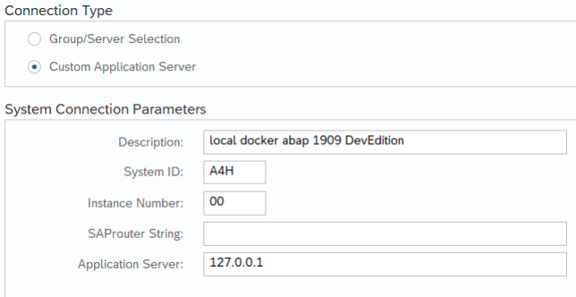
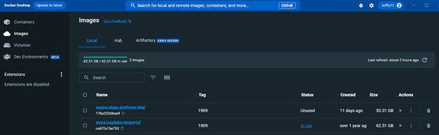
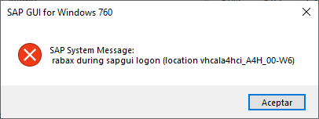
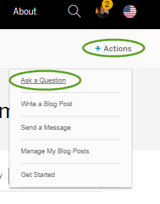

# ABAP Trial Platform on Docker: Frequently Asked Questions (FAQs) <!-- omit from toc -->

- [1 Getting Started](#1-getting-started)
  - [Getting started: MacBook](#getting-started-macbook)
  - [Getting started: Podman](#getting-started-podman)
    - [Shutting down gracefully](#shutting-down-gracefully)
    - [Restarting](#restarting)
    - [Other relevant Docker commands](#other-relevant-docker-commands)
  - [Set up SAP GUI and log on to the system ABAP Platform 1909](#set-up-sap-gui-and-log-on-to-the-system-abap-platform-1909)
- [2 Licenses](#2-licenses)
  - [ABAP Platform (AS ABAP)](#abap-platform-as-abap)
  - [SAP HANA Database (HDB)](#sap-hana-database-hdb)
- [3 Working with the ABAP developer edition](#3-working-with-the-abap-developer-edition)
- [4 Errors](#4-errors)
- [5 Users and Passwords](#5-users-and-passwords)
- [6 Resources](#6-resources)
  - [Troubleshooting Resources](#troubleshooting-resources)

*Table of Contents generated by *[Markdown All in One](https://marketplace.visualstudio.com/items?itemName=yzhang.markdown-all-in-one)*


# 1 Getting Started 
Please refer to the instructions in dockerhub:
[dockerhub - ABAP Platform Trial](https://hub.docker.com/r/sapse/abap-platform-trial) > **Overview**.

Before you start, please make sure:
- You understand the principles of docker container technology
- You know the entities docker image / docker container and their relationship
- You know the basic commands to work with images and containers


## Getting started: MacBook

Community member [Dylan Drummond](https://people.sap.com/murmelssonic)
has written an excellent guide to installing **ABAP Platform 1909
Developer Edition** on a MacBook:

[Install Abap Platform Developer Edition on Docker for
MacBook](https://blogs.sap.com/2021/05/31/install-abap-platform-developer-edition-on-docker-for-macbook/)


## Getting started: Podman


If you are familiar with [podman](https://podman.io/) and want to use it instead of docker, please add also the parameter *-t* to the docker run command to correctly forward SIGINT to the container's init process.


SAP Community member [Dylan Drummond](https://people.sap.com/murmelssonic) has written this excellent detailed guide:
[Using Podman for Abap Platform Trial container on Ubuntu Server and on amd64 MacBook](https://blogs.sap.com/2024/01/04/using-podman-for-abap-platform-trial-container-on-ubuntu-server-and-on-amd64-macbook/)


However, please note that we do not test this, so it is entirely own risk.


### Shutting down gracefully

**Important: Make sure you stop the container in a controlled manner:**


```bash
docker stop --time 7200 a4h
```

**Otherwise the container becomes unusable and all changes are lost. You
would then need to create a new one.**

### Restarting


```bash
docker start -ai a4h
```


### Other relevant Docker commands

```bash
docker exec -it a4h bash
```
- Create terminal within the docker image / container (equivalent to PuTTy)

```bash
docker images
```
- Returns list of all available images

```bash
docker inspect
```
– Returns detailed information, e.g. IP address of container

```bash

docker ps -a
```

– Returns list of containers, including stopped containers

For more information on docker commands, see [docker docs: Command-line
Reference](https://docs.docker.com/engine/reference/run/)


## Set up SAP GUI and log on to the system ABAP Platform 1909

1.  Install the SAP GUI that fits to your operating system, attached
    here.

2.  Set up System access (e.g. SAP GUI 7.70 for Windows)


    1.  Click on New, select Connection

    2.  Select user specific system:




3.  Logon to the system:

> | Parameter    | Value |
> | -------- | ------- |
> | User     | DEVELOPER |
> | Password | Ldtf5432 |
> | Language | EN |


Password for the a4hadm OS user in the container:

In Docker you don't need a password for user **a4hadm**. You just open a
new CMD prompt and switch users:


```bash

docker exec -it a4h bash  
su a4hadm
```


# 2 Licenses

## ABAP Platform (AS ABAP)

You can check the expiry date of your ABAP license in the transaction **SLICENSE** in SAPGUI. You may wish to set a reminder to update your license, since it is easier to do so before expiry.

**Updating the license via SAPGUI (SLICENSE)**: The ABAP license supplied with the Docker image lasts only three months. Therefore, you should download and import the demo license as follows:

1. Logon to your ABAP system with the user SAP*, client 000, same password as for DEVELOPER (DEVELOPER/001 is locked).
2. Start transaction SLICENSE; copy the hardware key.
3. In your browser, get a new license from [minisap](https://go.support.sap.com/minisap/#/minisap), choosing the system A4H.
4. Install the new license.
5. Back in your ABAP System, log off, then log on with the user DEVELOPER, client 001.
6. Start SLICENSE again; remove all the old licenses. (SAP* is not allowed to delete licenses).

**Updating the license via Docker**: The image contains a script which is able to update the AS ABAP license from the file you bind mount or copy to the container. Just save the text file onto your local file system and push it to the container at the path /opt/sap/ASABAP_license. The hardware key necessary for creation of the license file is printed out during start up phase of the container.

**Updating via Docker, new container**: Update the docker run command with -v <local path the key file>:/opt/sap/ASABAP_license. Please, make sure the -v parameter is on your command line before the Docker image name (sapse/abap-platform-trial:1909) because the parameter belongs to docker run and everything behind the image name is passed to programs inside the container.

**Updating via Docker, existing container**: Copy the key file to the container with the command `docker cp <local path the key file> a4h:/opt/sap/ASABAP_license`. If the container was stopped, the file will be applied when you start the container again. If the container is running, you can either stop and start the container or you can trigger the license update function via docker exec `-it a4h /usr/local/bin/asabap_license_update`.

If you run into trouble with the AS ABAP license update script, you can prevent the container from executing this function by passing the parameter `-no-asabap-license-update` or by creating the file `/opt/sap/.no_ASABAP_license_update` in the container.

## SAP HANA Database (HDB)

The image is shipped with a valid HDB license and it's not necessary to re-apply the license until it expires. You can check the expiry date of your HDB license in **DBA Cockpit > System Information > License**. You may wish to set a reminder to update your license, since it is easier to do so before expiry.

The image contains a script which is able to update the HDB license from the file you bind mount or copy to the container. So, if you run into the need to update HDB license, just save the text file onto your local file system and push it to the container at the path `/opt/sap/HDB_license`. The hardware key necessary for creation of the license file is printed out during start up phase of the container.

**New container**: Update the docker run command with `-v <local path the key file>:/opt/sap/HDB_license`. Please, make sure the `-v` parameter is on your command line before Docker image name `(sapse/abap-platform-trial:1909)` because the parameter belongs to to `docker run` and everything behind the image name is passed to programs inside the container.

**Existing container**: Copy the key file to the container with the command `docker cp <local path the key file> a4h:/opt/sap/HDB_license`. If the container was stopped, the file will be applied when you start the container again. If the container is running, you can either stop and start the container or you can trigger the license update function via `docker exec -it a4h /usr/local/bin/hdb_license_update`.

If you run into trouble with the license update script, you can prevent the container from executing this function by passing the parameter `-no-asabap-license-update` or by creating the file `/opt/sap/.no_HDB_license_update` in the container.


### Error in license Keys <!-- omit from toc --> 
e.g. "Logon not possible (error in license check). "
See section 4 Errors -> Logon not possible (error in license check)


### Deleting and installing the license using bash <!-- omit from toc --> 
1.	Start a4h and copy the hardware key


    ```bash

    docker start -ai a4h
    ```

2.	Generate key in the following link with the hardware key. https://go.support.sap.com/minisap/#/minisap

3.	Rename the file `A4H_Multiple.txt` to `A4H.txt`
4.	Copy the license

    ```bash

    docker cp A4H.txt a4h:/opt/sap/ASABAP_license
    ```
5.	Run the following command and the license will be activated


    ```bash

    docker start -ai a4h
    ```

6.	You can check the license with the `SLICENSE` transaction.

*Sources:
- [How to install a new license, Comment 590445](https://blogs.sap.com/2021/04/22/how-to-install-a-new-license-in-your-sap-abap-platform-developer-edition/comment-page-1/#comment-590445)
([RICARDO COYLLO MAYTA](https://people.sap.com/rcdesarrollo), September 24, 2021 at 5:40 pm)

- [Setup Instructions](https://hub.docker.com/_/sap-abap-trial/plans/ac8a4f9b-ae29-4afa-9b39-25aeea24b821?tab=instructions)

If you get an error, [Gregor Wolf](https://people.sap.com/gregorw) has helpfully provided a guide to updating the ABAP and HANA licenses:
[Update ABAP and HANA License for the ABAP Platform, Developer Edition for Docker](https://blogs.sap.com/2022/08/12/update-abap-and-hana-license-for-the-abap-platform-developer-edition-for-docker/)


# 3 Working with the ABAP developer edition

## Day 1 Experience, August 2023 by Martin Maruskin <!-- omit from toc --> 
Martin wrote a similar blog post for the previous version of 1909, Developer Edition, but this is the fresh version, hot off the press for 2023:
[Something about SAP: ABAP Platform Trial 1909 SP07](https://blog.maruskin.eu/2023/08/abap-platform-trial-1909-sp07.html)
Great to see people getting stuck in with the new Trial

[ABAP Trial Platform 1909, SP07 in Docker Desktop for Windows. H/T Martin Maruskin](https://blog.maruskin.eu/2023/08/abap-platform-trial-1909-sp07.html)




## Day 1 Experience and Tips and Tricks, 2021 by Thomas Jung <!-- omit from toc --> 

[Thomas Jung](https://people.sap.com/thomas.jung) shares his
“experiences installing the new ABAP developer edition on my Windows laptop. I run Docker on WSL2. Plus some general tips and commands that I found helpful along the way.” - refers to the previous edition, but is full of great info:

[SAP ABAP Platform 1909, Developer Edition: Day 1 Experience and Tips and Tricks](https://blogs.sap.com/2021/02/16/sap-abap-platform-1909-developer-edition-day-1-experience-and-tips-and-tricks/)


## Enhancing your Developer Edition – Community Blog Post from 2019<!-- omit from toc --> 
“…Interesting things how you can either enhance, tune, make more
advanced and similar sort of things to your SAP NetWeaver Application Server ABAP Developer edition” 
– again, this is from an older edition, but still very interesting collection by Martin Marushkin (Twitter: [MartinMar](https://twitter.com/softy012)), some basic, some quite advanced. Just one small point: In 1909, abapGit is automatically installed and SAP Flight Reference Scenario automatically pre-delivered , so no need to repeat sections 4 and 5:

[Power up your SAP NetWeaver Application Server ABAP Developer
edition](https://blog.maruskin.eu/2019/11/power-up-your-sap-netweaver-application.html)

## ABAP Database Managed Procedures (AMDP) + SAP BW <!-- omit from toc --> 
Yes, this works.

However, if you want to use AMDPs in conjunction with SAP BW, you need
to apply the correct SAP Notes. **That is, you must be a customer or
partner.**

*Source: <https://twitter.com/pawelwiejkut/status/1383495200547377153>*

## abapGIT, Can I use? <!-- omit from toc --> 
YES.
Briefly, abapGIT is a GIT client written in ABAP for ABAP. It offers an easy way for developers to upload their ABAP development objects to / import others’ interesting development objects to an openly available Git site. And it really is easy.
Follow this blog for a great, end-to-end guide to installing the tool and cloning a sample package into your developer edition: https://blogs.sap.com/2017/06/21/abapgit-so-easy/ (GrahamRobbo)
UPDATE: abapGit is now available for ABAP Development Tools (i.e. Eclipse): http://eclipse.abapgit.org/updatesite/
There is a useful collection of projects here:
•	http://dotabap.org/
•	https://github.com/SAP-samples


## Language support, Adding to SAP ABAP Platform 1909 <!-- omit from toc --> 

See this blog post for more information: *Source:
<https://blogs.sap.com/2021/02/24/adding-languages-to-sap-abap-platform-1909-developer-edition-for-multilingual-development>*

## Persistence: How is the data in the ABAP container persisted? <!-- omit from toc -->

The data is persisted in the Docker scratch space. For more information,
see : [docker scratch
space](https://docs.docker.com/get-started/05_persisting_data/)

## Podman, can I use instead of Docker? <!-- omit from toc --> 

Yes. If you are familiar with [podman](https://podman.io/) and want to use it instead of docker, please add also the parameter *-t* to the docker run command to correctly forward SIGINT to the container's init process.

If you are unfamiliar with but interested in using Podman, SAP Community member [Dylan Drummond](https://people.sap.com/murmelssonic) has written this excellent detailed guide:
[Using Podman for Abap Platform Trial container on Ubuntu Server and on amd64 MacBook](https://blogs.sap.com/2024/01/04/using-podman-for-abap-platform-trial-container-on-ubuntu-server-and-on-amd64-macbook/)

## SAP Business / SAP S/4HANA content – eg. FB01, MM03, VA01 <!-- omit from toc --> 

We do not include business transactions in the developer edition,
because it is purely intended for learning ABAP syntax and tools.

If you want to play around with business content:

1.  If you just want some example tables / DDIC objects / dev objects to
    practise on, you can use the EPM model in S_NWDEMO , eg Purchase
    Order DDIC objects inS_NWDEMO_MODEL_DDIC, eg SNWD_PO.

2.  To access a fully-activated S/4HANA (1809 or 2009) appliance: [SAP
    S/4HANA Fully-Activated Appliance: Create your SAP S/4HANA system in
    a fraction of the usual setup
    time](https://blogs.sap.com/2018/12/12/sap-s4hana-fully-activated-appliance-create-your-sap-s4hana-1809-system-in-a-fraction-of-the-usual-setup-time/)

3.  For SAP Customers and Partners, we also offer IDES Systems: [799639
    – IDES – General Information about the usage of IDES
    systems](https://launchpad.support.sap.com/#/notes/799639)

## SAP Fiori launchpad, connect to: <!-- omit from toc --> 

You must edit the Hosts file – on local machine, not inside Docker

*Source:
<https://answers.sap.com/questions/13296560/abap-trial-sap-abap-platform-1909-start-fiori-laun.html>*## SAP HANA Studio

You can install the HANA tools as Eclipse plugin
-\> <https://tools.hana.ondemand.com/#hanatools>

## SAP GUI for Java ("JavaGUI"), connect to: <!-- omit from toc --> 
Ignore the System, Logon, Security, Language tabs. Go to Advanced tab > Expert Mode > enter IP address OR mapped DNS name of VM of your SAP System + SAP instance number (default = 00).
e.g. NPL system, on VM on host 192.168.64.11, main instance = 00, hence SAPGUI port = 3200 => Connection string = 

``` 
conn=/H/192.168.64.11/S/3200
```

Depending on the Hypervisor you use, you may need to set up port forwarding from local machine port 3200 (say) to the VM port 3200.
*(From: https://blogs.sap.com/2019/10/01/as-abap-7.52-sp04-developer-edition-concise-installation-guide/comment-page-1/#comment-625449 )


## SAP HANA database - via external tools, e.g. SAP HANA Studio, DBeaver, WebIDE <!-- omit from toc --> 

### Solution 1, connect to: <!-- omit from toc --> 

If you want to connect to HANA via external tools like HANA Studio oder
DBeaver, you have to publish the ports 30213 and 30215 in the docker run
command.

Same with WebIDE:


```bash

-p 8080:8080 or -p 53075:53075
```

*Source:
<https://blogs.sap.com/2021/02/15/sap-abap-platform-1909-developer-edition-available-soon/comment-page-1/#comment-558716>*

### Solution 2: Troubleshooting <!-- omit from toc --> 

“I ran into problem with tenant connection from Hana Studio, and it was
resolved with [SAP Note 2551889](https://launchpad.support.sap.com/#/notes/2551889)”

*Source:
<https://blogs.sap.com/2021/02/15/sap-abap-platform-1909-developer-edition-available-soon/comment-page-1/#comment-560001>*

## SAP HANA, Using Multi Model Capabilities of <!-- omit from toc --> 

Great three-part blog series by Uwe Fetzer on:

-   [Part I: Document Store aka NoSQL
    database](https://blogs.sap.com/2021/02/16/using-multi-model-capabilities-of-sap-hana-in-the-new-abap-1909-developer-edition-part-i-document-store/)

-   [Part II: Spatial
    functions](https://blogs.sap.com/2021/02/16/using-multi-model-capabilities-of-sap-hana-in-the-new-abap-1909-developer-edition-part-ii-spatial-functions/)

-   [Part III: Graph
    functions](https://blogs.sap.com/2021/02/18/using-multi-model-capabilities-of-sap-hana-in-the-new-abap-1909-developer-edition-part-iii-graph-functions/)

## SAP Screen Personas, using developer edition with <!-- omit from toc --> 

Note: SAP Customers and Partners only.

Steve Rumsby has written an excellent blog post on how to set this up:

[SAP Screen Personas on the ABAP developer edition
system](https://blogs.sap.com/2021/03/22/sap-screen-personas-on-the-abap-developer-edition/)

## SSL certificate, Secure your SAP ABAP System with <!-- omit from toc --> 

Video by Jakub Marius Kjaer:

<https://www.youtube.com/watch?v=k9ET6clRjG8>

## WinSCP or equivalent <!-- omit from toc --> 
1.	Easiest: **Before running container**: Share a common folder between the docker image and the host using the `-v` flag in the `docker run`.

2. Start a web server on you host PC (for example with `Xampp`) and `CURL` the files from the docker image.

## Wireshark with SAP Dissectors for Ubuntu and macOS <!-- omit from toc --> 
[Wireshark with SAP Dissectors for Ubuntu and macOS](https://blogs.sap.com/2022/06/12/wireshark-with-sap-dissectors-for-ubuntu-and-macos/)
By Dylan Drummond

# 4 Errors  

## Azure Container Instance, error trying to connect with <!-- omit from toc --> 

**UPDATE, 2<sup>nd</sup> March, 2021**

**“**The maximum size for a deployable container image on Azure
Container Instances is 15 GB;  You might be able to deploy larger images
depending on the exact availability at the moment you deploy, but this
is not guaranteed.

<https://docs.microsoft.com/en-us/azure/container-instances/container-instances-faq#how-large-can-my-container-image-be>
“

*Source:
<https://answers.sap.com/questions/13291704/deploy-abap-platform-developer-edition-1909-docker.html?childToView=13295341#comment-13295341>*

## SAP Business Warehouse + AMDP: Errors <!-- omit from toc --> 
 
<https://twitter.com/pawelwiejkut/status/1383495200547377153> - only for
SAP BW users using AMDPs

## SAP GUI, error starting <!-- omit from toc --> 



1.  System hasn’t warmed up

2.  Hosts file

3.  Resources

4.  Check ST22 (“Rabax”)

You can eliminate the popup and get the rabax directly by:

Eliminate the "rabax during sapgui logon" popup and display the dump
(recommended):

1.  Set profile parameter "login/quiet_mode" to 0.

2.  Restart the system so that profile parameter changes take effect.

3.  Reproduce the issue (logon to the system).

4.  The popup "rabax during sapgui logon" should disappear now and
    you are able to:see the dump directly.

Taken from SAP Note 429578 - How to deal with error "rabax during sapgui
logon

*Source:
<https://blogs.sap.com/2021/02/15/sap-abap-platform-1909-developer-edition-available-soon/comment-page-1/#comment-558556>*

## License check, error in <!-- omit from toc --> 
Cause: The Linux OS, e.g. SLES has the wrong date.
Solution: Check the date and time of the server at OS level, in order to verify that it’s correct.

That is, executecommand “date” (without quotes) **in Linux** (not Windows).

The SAP system receives the time and the date from the OS. Therefore, you need to stop the system, adjust the correct system's date/time on OS level and re-start the system.

If you are an SAP customer or partner, see [SAP Note 2164980](https://launchpad.support.sap.com/#/notes/0002164980) for details.

## Slow start in Docker Desktop, Mac / Windows <!-- omit from toc --> 
The issue is that Docker Desktop uses a fixed amount of memory as defined in the resource config. If I want to run A4H on my MacBook then I set it to 20GB, and that's what Docker Desktop will consume on startup - even if I just want to run a tiny Kroki or Gitea system. Therefore starting up a 16GB+ Docker Desktop takes a little while if you want to run A4H on non-Linux hosts. 

Secondly, A4H startup gets to a login-able state in a couple of minutes but then spends a good 10 minutes or so exercising the CPU fan by "doing stuff" (on Linux too) until it settles down. It's not really useable during this time so I consider this startup time.

After a total of 20 minutes it's fast. Once it's settled in, I can run both A4H and 7.52 on VMware simultaneously on my 32GB MacBook without a problem, I can even start Windows VM too if I need it.
[Comment by Mike Pokraka](https://blogs.sap.com/2021/02/15/sap-abap-platform-1909-developer-edition-available-soon/comment-page-2/#comment-623886)
 
## Slowing down, developer edition is <!-- omit from toc --> 

“Lately, I find that I have had to compress my VM Drive to keep the
system from slowing down” or similar.

This answer includes SAP Community content, so use it at your own risk.

“There are several utility programs available, for example:

Application Log: Delete logs in SAP (SLG2).

You can also Display logs in SAP (SLG1).

More information here:

[SLG2 SAP tcode - Application Log: Delete
logs](https://www.se80.co.uk/saptcodes/s/slg2/slg2.htm)

Also: Delete ST22 dumps by running RSSNAPDL.

More information here:

[RSSNAPDL SAP ABAP Report - Reorganization Program for Table SNAP of
Short Dumps](https://www.se80.co.uk/sapreports/r/rssn/rssnapdl.htm)”

*Source:
<https://blogs.sap.com/2021/02/15/sap-abap-platform-1909-developer-edition-available-soon/>
Search: SLG2*

See also: [Power up your SAP NetWeaver Application Server ABAP Developer
edition](https://blog.maruskin.eu/2019/11/power-up-your-sap-netweaver-application.html),
sections 2, 3, 8, 9

# 5 Users and Passwords

**Normal user/password:**


> User: DEVELOPER
>
> Password: Ldtf5432

**Password for the a4hadm OS user in the container**

In Docker you don't need a password for user **a4hadm**. You just open a
new CMD prompt and switch users.


```bash
docker exec -it a4h bash  
su a4hadm
```


# 6 Resources

[Setup Instructions](https://hub.docker.com/_/sap-abap-trial/plans/ac8a4f9b-ae29-4afa-9b39-25aeea24b821?tab=instructions)

## Troubleshooting Resources

For troubleshooting, ask your question in the ABAP Development Community
forum:

<https://www.sap.com/community/topic/abap/all-content.html>



If it is an issue involving ABAP developer edition, remember to add the
hashtag **\#ABAP_Trial**.


Please do **not** use comments in the blog posts to ask tech support

questions:

-   It makes it difficult for other users to find similar issues in
    future, which leads to many duplicated errors.


-   Very few people follow these blog posts, so you will not get help from
    the vast majority of the community

-   There is no capacity to monitor all blog posts for all released versions.

